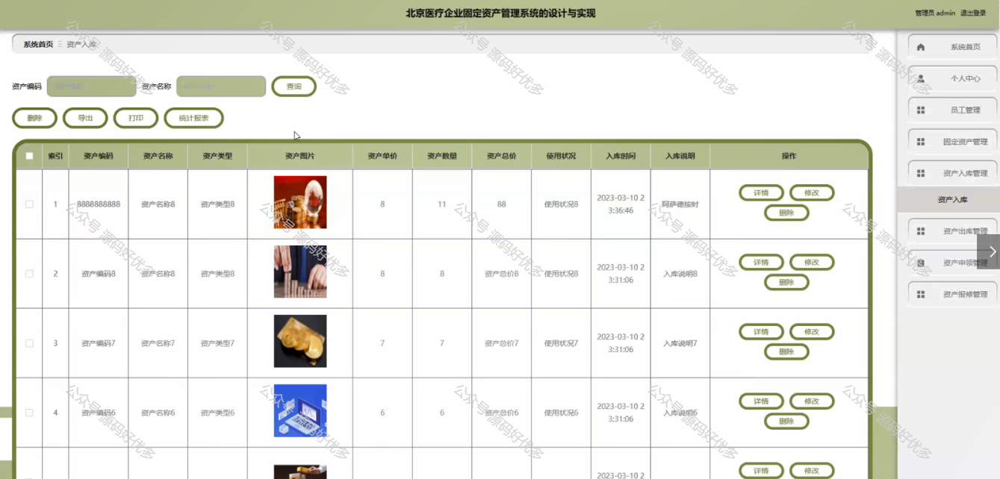

 
## 查看主页获取源码

> **作者介绍**： **✌**全网粉丝10W+本平台特邀作者、博客专家、CSDN新星计划导师、java领域优质创作者,博客之星、掘金/华为云/阿里云/InfoQ等平台优质作者、专注于项目实战 **✌**

  

### 一、作品包含

源码+数据库+设计文档万字+PPT+全套环境和工具资源+部署教程

### 二、项目技术

前端技术：Html、Css、Js、Vue、Element-ui

数据库：MySQL

后端技术：Java、Spring Boot、MyBatis

  

### 三、运行环境

开发工具：IDEA/eclipse

数据库：MySQL5.7

数据库管理工具：Navicat10以上版本

环境配置软件： JDK1.8+Maven3.6.3

前端Nodejs：14

### 四、项目介绍
项目编号：springbootA132

北京医疗企业固定资产管理系统是在我国医疗行业快速发展的背景下应运而生的一款管理系统。随着医疗企业规模的不断扩大，固定资产的种类和数量日益增多，如何高效管理和维护这些资产成为企业运营中的关键问题。该系统旨在通过信息化手段，对医疗企业的固定资产进行全生命周期管理，提高资产利用率，降低运营成本，确保医疗设备的正常运行，从而为医疗企业提供强有力的后勤保障。

系统分为管理员和员工
管理员的功能：系统首页、个人中心、员工管理、固定资产管理、资产入库管理、资产出库管理、资产申领管理、资产申报修管理。
员工的功能：系统首页、个人中心、固定资产管理、资产申领管理、资产报修管理。

### 五、运行截图

  
